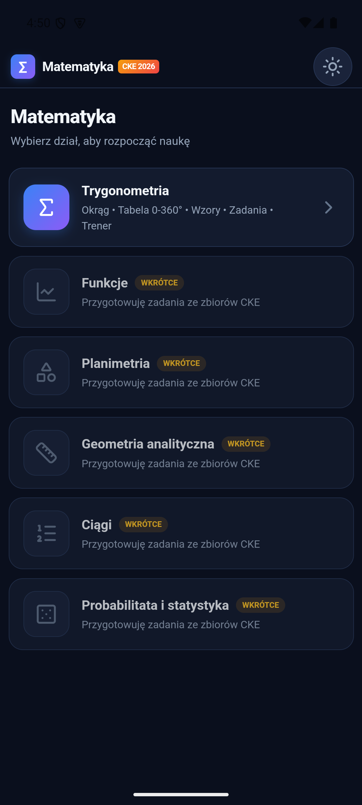
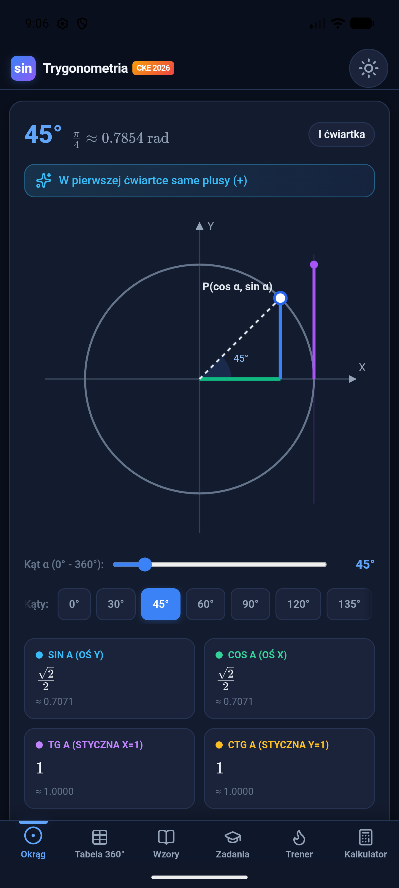
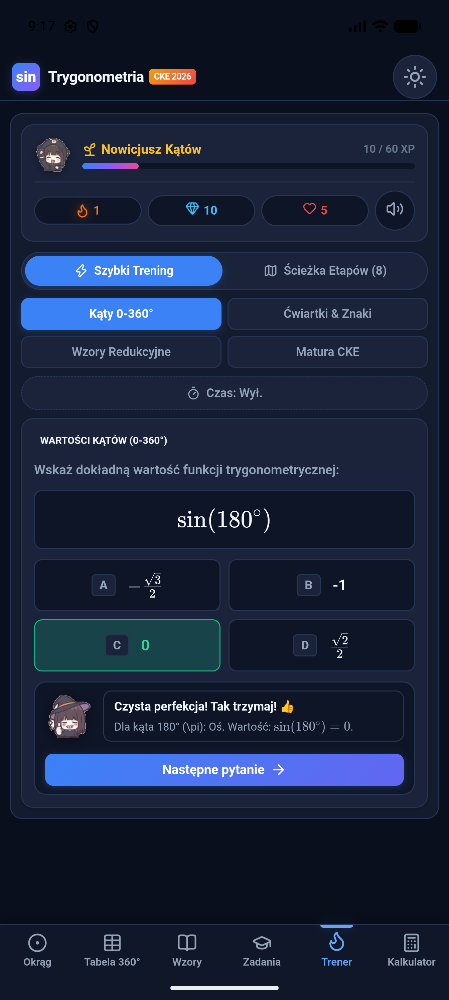
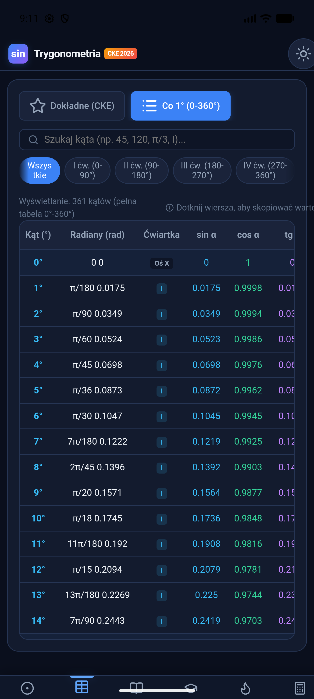
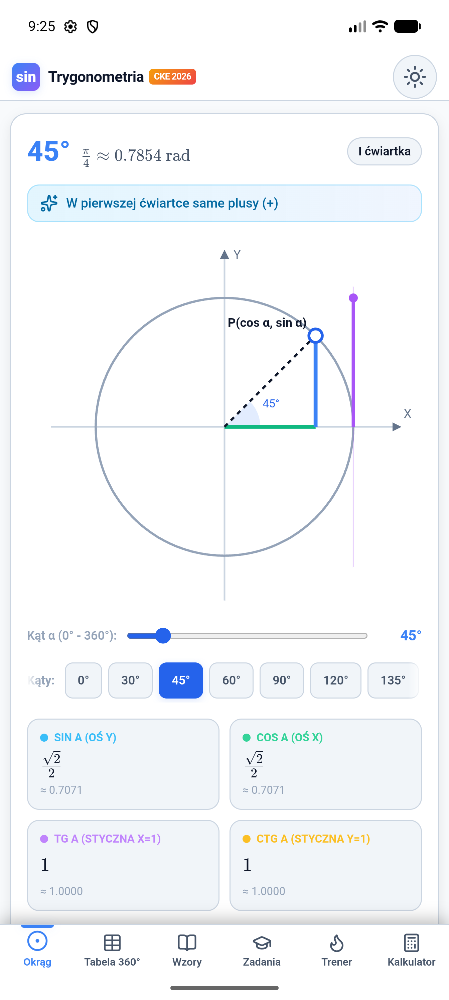

# 📐 Matematyka — zakres rozszerzony

> Interaktywna aplikacja do nauki matematyki w zakresie rozszerzonym — startowo **trygonometria**, kolejne działy w przygotowaniu.


Aplikacja łączy **okrąg trygonometryczny z obsługą dotyku**, pełną **tabelę wartości 0–360°**, **kompendium wzorów** z weryfikatorem tożsamości, **bazę zadań** oraz **trener quiz** w stylu Duolingo — wszystko w jednym, offline-first, w pełni po polsku.

---

## 🖼 Ekrany

| Menu działów | Okrąg trygonometryczny | Trener quiz |
|:---:|:---:|:---:|
|  |  |  |

| Tabela 0–360° (co 1°) | Motyw jasny |
|:---:|:---:|
|  |  |

---

## ✨ Funkcje

### 🎯 Menu startowe (hub)
Aplikacja rośnie w kierunku pełnej matematyki rozszerzonej — startujemy z wyborem działu. Dostępne dziś: **Trygonometria**. W przygotowaniu: *Funkcje, Planimetria, Geometria analityczna, Ciągi, Probabilitata i statystyka*.

### 📊 Okrąg trygonometryczny
- Płynne przeciąganie palcem z **przyciąganiem do kątów charakterystycznych** (±3°)
- Rzutowania sin/cos, styczna tg/ctg, wierszyk o ćwiartkach zmieniany dynamicznie
- Canvas rysowany w rozdzielczości **HiDPI** (ostry na każdym ekranie), paleta czytana z aktualnego motywu

### 📋 Tabela wartości 0–360°
- Tryb **„Dokładne"** — kąty charakterystyczne z pierwiastkami (KaTeX)
- Tryb **„Co 1°"** — 361 wierszy na czystych liczbach, render natychmiastowy
- Wyszukiwarka (`45`, `π/3`, `III`…), filtry ćwiartek, tapnięcie wiersza = kopiowanie wartości

### 📚 Wzory i zadania
- Kompendium wzorów z wyszukiwarką i kategoriami
- **Weryfikator tożsamości L = P** i kalkulator wzorów redukcyjnych z krokami
- Baza zadań z arkuszy z podpowiedziami i rozwiązaniami krok po kroku

### 🔥 Trener (styl Duolingo)
- 4 tryby: *Kąty 0–360°, Ćwiartki & znaki, Wzory redukcyjne, Arkusze zadań*
- **XP, poziomy, serie (combo), serduszka**, tryb na czas (30/15/8 s) i konfetti
- **Ścieżka 8 etapów** z uczciwą progresją gwiazdek (2 poprawne odpowiedzi = ⭐)

### 🧮 Kalkulatory
- Trójkąt prostokątny, punkt P(a, b) w układzie współrzędnych, konwerter **stopnie ⇄ radiany** — wszystkie z żywą wizualizacją SVG

---

## 📥 Instalacja (Android)

1. Wejdź w [**Releases**](https://github.com/KubeKoslaw/Matma/releases)
2. Pobierz `Trygonometria.apk` z najnowszej wersji
3. Zezwól na instalację z nieznanych źródeł i zainstaluj

> Wymagany **Android 7.0+** (minSdk 24). Aplikacja działa **w pełni offline** — wszystkie treści (w tym renderer wzorów KaTeX) są wbudowane.

---

## 🛠 Budowanie ze źródeł

**Android** (wymagany Android SDK, API 35):
```bash
cd android
./gradlew assembleDebug
# APK: android/app/build/outputs/apk/debug/app-debug.apk
```

**Web / PWA** — katalog główny to zwykła strona statyczna:
```bash
python3 -m http.server 8080
# http://localhost:8080
```

Synchronizacja wspólnej bazy kodu web ↔ Android:
```bash
npm run sync:www   # katalog główny → android/app/src/main/assets/www
npm run sync:root  # android/app/src/main/assets/www → katalog główny
```

---

## 🗂 Struktura projektu

```
├── index.html, css/, js/     # wspólny kod aplikacji (PWA)
│   └── js/modules/           # hub, okrąg, tabela, wzory, zadania, trener, kalkulatory
├── vendor/                   # KaTeX + Lucide (offline)
├── android/                  # natywna powłoka Android (WebView)
│   └── app/src/main/assets/www/   # kopia kodu web wklejana do APK
├── scripts/                  # narzędzia do przygotowania treści działów
└── docs/screenshots/         # zrzuty ekranu do README
```

Warstwa Android to minimalny wrapper: `WebView` + `WebViewAssetLoader` (bezpieczny lokalny origin dla ES modules), insety systemowe przekazywane do strony jako zmienne CSS (`--safe-top` / `--safe-bottom` / `--kb-bottom`).

---

## 🧰 Technologie

| Warstwa | Technologia |
|---|---|
| UI | Vanilla JS (ES modules), CSS z podwójnym motywem (jasny/ciemny) |
| Wzory | [KaTeX](https://katex.org) (vendored, offline) |
| Ikony | [Lucide](https://lucide.dev) (vendored, offline) |
| Grafika interaktywna | Canvas 2D (okrąg), SVG (kalkulatory) |
| Android | WebView + WebViewAssetLoader, Gradle Kotlin DSL, minSdk 24 / target 35 |

---

## 🗺 Roadmapa

- [x] Trygonometria (kompletna)
- [ ] Funkcje — *zadania w przygotowaniu*
- [ ] Planimetria — *zadania w przygotowaniu*
- [ ] Geometria analityczna — *zadania w przygotowaniu*
- [ ] Ciągi — *zadania w przygotowaniu*
- [ ] Probabilitata i statystyka — *zadania w przygotowaniu*
- [ ] Tryb nauki pytaniami otwartymi z oceną kroków

---

*© 2026 KubeKoslaw — projekt edukacyjny: matematyka w zakresie rozszerzonym.*
